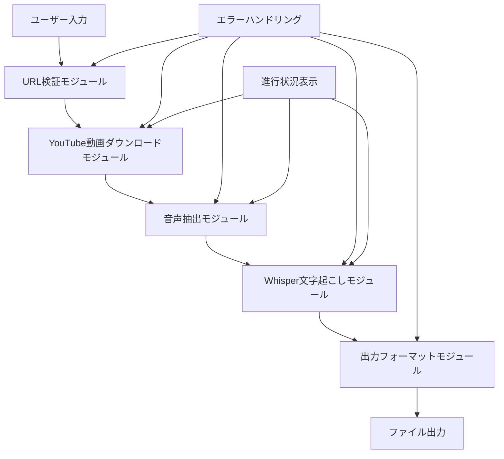

# 設計書

## 概要

YouTube文字起こしツールは、YouTube動画のURLを入力として受け取り、Whisper Large V3モデルを使用して高精度な文字起こしを提供するPythonアプリケーションです。

## アーキテクチャ

### システム構成図



### 技術スタック

- **プログラミング言語**: Python 3.8+
- **YouTube動画ダウンロード**: yt-dlp
- **音声処理**: ffmpeg-python
- **文字起こし**: openai-whisper (Large V3モデル)
- **コマンドライン**: argparse
- **ファイル処理**: pathlib, json

## コンポーネントと インターフェース

### 1. URLValidatorクラス

```python
class URLValidator:
    def validate_youtube_url(self, url: str) -> bool
    def extract_video_id(self, url: str) -> str
```

**責任**: YouTube URLの検証と動画IDの抽出

### 2. YouTubeDownloaderクラス

```python
class YouTubeDownloader:
    def download_audio(self, url: str, output_path: str) -> str
    def get_video_info(self, url: str) -> dict
```

**責任**: YouTube動画の音声ダウンロードと動画情報の取得

### 3. AudioProcessorクラス

```python
class AudioProcessor:
    def extract_audio(self, video_path: str, audio_path: str) -> str
    def convert_to_wav(self, input_path: str, output_path: str) -> str
```

**責任**: 動画ファイルからの音声抽出とフォーマット変換

### 4. WhisperTranscriberクラス

```python
class WhisperTranscriber:
    def __init__(self, model_name: str = "large-v3")
    def transcribe(self, audio_path: str) -> dict
    def transcribe_with_timestamps(self, audio_path: str) -> dict
```

**責任**: Whisperモデルを使用した文字起こし処理

### 5. OutputFormatterクラス

```python
class OutputFormatter:
    def format_as_text(self, transcription: dict) -> str
    def format_as_srt(self, transcription: dict) -> str
    def format_as_json(self, transcription: dict) -> str
```

**責任**: 文字起こし結果の各種フォーマットへの変換

### 6. ProgressTrackerクラス

```python
class ProgressTracker:
    def show_progress(self, stage: str, message: str) -> None
    def show_error(self, error_message: str) -> None
    def show_completion(self, output_file: str) -> None
```

**責任**: 処理進行状況の表示とユーザーフィードバック

### 7. TranscriptionManagerクラス（メインコントローラー）

```python
class TranscriptionManager:
    def __init__(self)
    def process_video(self, url: str, output_path: str, format: str) -> str
    def cleanup_temp_files(self, temp_files: list) -> None
```

**責任**: 全体的な処理フローの制御と一時ファイルの管理

## データモデル

### TranscriptionResult

```python
@dataclass
class TranscriptionResult:
    text: str
    segments: List[TranscriptionSegment]
    language: str
    duration: float
    
@dataclass
class TranscriptionSegment:
    start: float
    end: float
    text: str
    confidence: float
```

### VideoInfo

```python
@dataclass
class VideoInfo:
    title: str
    duration: int
    uploader: str
    upload_date: str
    video_id: str
```

### ProcessingConfig

```python
@dataclass
class ProcessingConfig:
    model_name: str = "large-v3"
    output_format: str = "txt"
    output_path: str = None
    temp_dir: str = "./temp"
    cleanup_temp: bool = True
```

## エラーハンドリング

### カスタム例外クラス

```python
class TranscriptionError(Exception):
    pass

class URLValidationError(TranscriptionError):
    pass

class DownloadError(TranscriptionError):
    pass

class AudioProcessingError(TranscriptionError):
    pass

class WhisperError(TranscriptionError):
    pass
```

### エラー処理戦略

1. **URL検証エラー**: 無効なURLの場合、適切なエラーメッセージを表示して終了
2. **ダウンロードエラー**: ネットワークエラーや動画アクセス不可の場合、リトライ機能を提供
3. **音声処理エラー**: ffmpegエラーの場合、詳細なエラー情報を提供
4. **Whisperエラー**: モデル読み込みや処理エラーの場合、メモリ不足やGPU関連の問題を診断

## テスト戦略

### ユニットテスト

- 各クラスの個別機能テスト
- モックを使用した外部依存関係の分離
- エラーケースのテスト

### 統合テスト

- 実際のYouTube動画を使用したエンドツーエンドテスト
- 異なる動画長、言語、品質でのテスト
- 出力フォーマットの検証

### パフォーマンステスト

- 長時間動画での処理時間測定
- メモリ使用量の監視
- GPU使用時とCPU使用時の比較

### テストデータ

- 短時間テスト動画（1-2分）
- 中時間テスト動画（10-15分）
- 多言語テスト動画
- 音質の異なるテスト動画

## セキュリティ考慮事項

1. **入力検証**: YouTube URL以外の悪意のあるURLの拒否
2. **ファイルシステム**: 一時ファイルの安全な作成と削除
3. **リソース制限**: 大容量動画に対する制限設定
4. **依存関係**: 使用ライブラリの脆弱性チェック

## パフォーマンス最適化

1. **GPU活用**: CUDA対応環境でのGPU使用
2. **メモリ管理**: 大容量音声ファイルのストリーミング処理
3. **並列処理**: 複数動画の同時処理サポート（将来拡張）
4. **キャッシュ**: 同一動画の再処理時のキャッシュ活用

## 配布とインストール

### 依存関係

```
openai-whisper>=20231117
yt-dlp>=2023.12.30
ffmpeg-python>=0.2.0
torch>=2.0.0
torchaudio>=2.0.0
```

### インストール手順

1. Python 3.8+のインストール
2. ffmpegのシステムインストール
3. pipを使用した依存関係のインストール
4. GPU使用の場合、CUDA環境の設定